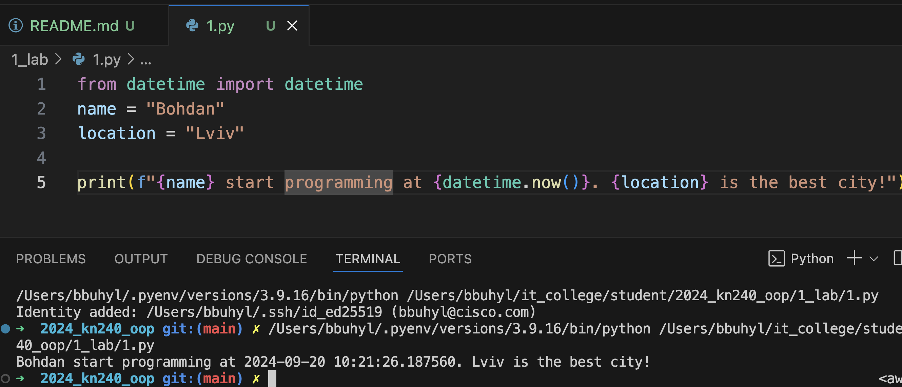

# Звіт до роботи 1
## Тема: _Вступ та налаштування середовищи_
### Мета роботи: _Встановити необхідні програми, налаштувати локальне середовище розробки, створити власний репозиторій, попрацювати з форматуванням Markdown та оформити звіт_

---
### Виконання роботи
* Результати виконання завдань:
    1. Встановили Пайтон та Visual Studio Code;
    1. Створили власний репозиторій, посилання на нього [<<<тиць>>>](https://github.com/BobasB/2024_kn240_oop);
    1. Створили початкову сторінку з допомогою ChatGPT;
    1. Навчились працювати з Markdown
* Доналаштували локальне середовище та встановили Плагіни та приступаємо до першої програми;
* Створили [Пайтон файл](1.py) вставили код програми та запустили її. Результат виконання програми показано на скріншоті нижче:
    
* Продовжуємо роботу та виконувати програму тепер у [Пайтон Ноутбуці](1.ipynb). Результа виконання предствлени на скріншоті:
    
* результати виконання індивідуального завдання (РОБИТИ самостійно);

---
### Висновок:
> у висновку потрібно відповісти на запитання:

- :question: Що зроблено в роботі: Написали першу програму та навчились її запускати.
- :question: Чи досягнуто мети роботи;
- :question: Які нові знання отримано;
- :question: Чи вдалось відповісти на всі питання задані в ході роботи;
- :question: Чи вдалося виконати всі завдання;
- :question: Чи виникли складності у виконанні завдання;
- :question: Чи подобається такий формат здачі роботи (Feedback);
- :question: Побажання для покращення (Suggestions);

---